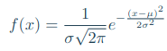

# 205IQ

Most of the reference curves, such as weight and height cruves, are created using Gaussian distributions. These curves appear to correctly describe “normality”, and that is why the Gaussian distribution is also called normal distribution. A normal distribution is described by its mean value *μ* and standard deviation *σ* with the following probability density function:



IQ tests are calibrated so that the results follow a normal distribution. The interpretation of the resulting IQ obviously depends on the calibration of the test. Most of the time, the mean is equal to 100. The standard deviation is usually 15 but can vary (24 in the Cattell test, for example. IQ values are always between 0 and 200.

## Task

- given *μ* and *σ*, plot the density function of the IQ for every integer between 0 and 200,
- given *μ*, *σ* and one IQ value, print the percentage of people with an IQ inferior to this value,
- given *μ*, *σ* and two IQ values, print the percentage of people with an IQ in between those values.

## Compile

The project compile with *Makefile*:

For compile the project use the commande:

```console
foo@bar:~/205IQ$ make re
```

For clean the project use:

```console
foo@bar:~/205IQ$ make fclean
```

Get instruction with:


```console
foo@bar:~/205IQ$ ./205IQ -h
```

